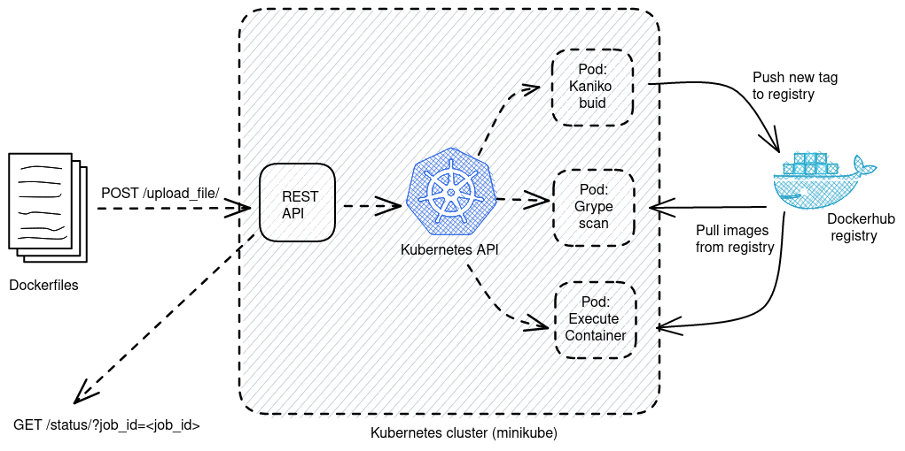

# Dockerfile processing platform
## Project description

This project aims at providing a secure platform which allows to:
- Submit a dockerfile to a REST API and return a job ID
- Retrieve the status and a performance if it exists associated with the job

Once a dockerfile is received, the service builds the docker image, scans its vulnerabilities,
and then according to the scan result:
- Assigns a fail status to the job
- Executes the container in the most secure environment possible and associates to
the job the performance (the decimal) and a success status.

It is assumed that during its execution, the container writes the (decimal) performance to a file
`/data/perf.json`. The /data directory of the container is set up on a volume to be able to
retrieve the performance at the end of its execution.

An example of such a Dockerfile is provided below:
```dockerfile
FROM ubuntu:latest
# train machine learning model
# save performances
CMD echo '{"perf":0.99}' > /data/perf.json
```

## Platform architecture




### Kubernetes
Of all the possibilities for building the platform, two options were considered based on the popularity of its
core technology/principles:
- building a REST API, which commands local executions of
 `docker build`, `docker scan` and `docker run` actions
- setting up a [Kubernetes](https://kubernetes.io/) cluster, deploy and expose the REST API within this cluster 
and use the kubernetes API to create the appropriate jobs

Since we want to deploy our REST API as a docker container, the first option would involve docker-in-docker operations.
This practice is known to be a security threat, which is a serious drawback for this option. For more information:
- https://docs.docker.com/engine/security/protect-access/ 
- https://integratedcode.us/2016/04/08/user-namespaces-sharing-the-docker-unix-socket/

Moreover, Kubernetes provides [client librairies](https://kubernetes.io/docs/reference/using-api/client-libraries/)
out of the box to provision the required ressources for our use case, making it an interesting candidate.  

[Minikube](https://minikube.sigs.k8s.io/docs/) is a popular solution for local Kubernetes experiments,
we will use it to deploy our Kubernetes cluster locally.

### Python & Fast API
Kubernetes provides a [Python API](https://github.com/kubernetes-client/python) offering all the required control
over a Kubernetes cluster.
Since Python librairies such as [FastAPI](https://fastapi.tiangolo.com/) make it easy to spin up a
simple and performant REST API, we can achieve the desired functionalities by:
 - building an API with FastAPI, exposing it within our Kubernetes cluster
 - within our API : instantiate a Kubernetes API Python object and manage all jobs from here

### Building docker images: Kaniko
From the official documentation: *"[Kaniko](https://github.com/GoogleContainerTools/kaniko) a tool to build
container images from a Dockerfile, inside a container or Kubernetes cluster."*

Kaniko fits our technical requirements for building docker images and is easy to deploy in a Kubernetes cluster.

### Scanning docker images for vulnerabilities : Grype
Scanning docker images before execution becomes a required security measure. Here are a few famous
[options](https://geekflare.com/container-security-scanners/):
 - [Clair](https://github.com/quay/clair)
 - [Grype](https://github.com/anchore/grype)
 - [Snyk](https://docs.snyk.io/more-info/getting-started/snyk-integrations/docker/scanning-with-the-docker-cli)

These three tools are used by major players in the tech industry and each one of them would be a relevant choice.
We chose to go with Grype for a number of reasons:
 - Easy to set up. One just needs to pull a docker image and use the grype CLI provided as the image entrypoint
 - Used by major players in the DevSecOps space,
including [Gitlab](https://about.gitlab.com/blog/2021/07/28/secure-container-images-with-gitlab-and-grype/)
 - Snyk requires either executing `docker scan` or having a paid license to be deployed on a Kubernetes cluster
 - Clair is a little more complicated to deploy

**Remark:** For testing purposes, Grype is set to work with `--fail-on=critical` flag, to avoid detecting
too many vulnerabilities. In a production deployment, scanning severity could be raised by setting `--fail-on`
to `medium` or `low` for example.


## Going further
This platform is far from being complete. Several improvements can be made to enhance its security and performance.

### Next steps: security
Some measures should be applied before considering the deployment of this platform in production:
- Use a dedicated Kubernetes service account to run the Rest API and implement
a better [RBAC](https://kubernetes.io/docs/concepts/security/rbac-good-practices/) on the cluster
- Protect docker-registry secrets. **The credentials listed in this document are for testing purpose only**.
They may be changed and removed in the future.

### Next steps: performance

#### Cluster deployment, automation and observability
Platform automation:
- creating secrets, volumes and volume claims using the Python client should be possible.
It would reduce the number of manual operations when deploying the platform.
- The current Python scheduling and orchestration of Pods may be partly replaced by leveraging 
[Kubernetes Jobs](https://kubernetes.io/docs/concepts/workloads/controllers/job/),
to implement features such as handling container failures.

Observability could be largely improved as well. Quick thoughts:
- begin by improving the REST API logging capabilities
- leverage Kubernetes built-in observability features to handle most of the complicated work (cluster state, metrics, ...)

#### Designing for scale
The cluster is currently deployed with Minikube, which is not production-suitable.
Deploying this platform in production will require using an existing Kubernetes cluster. This could help improving:

- The platform capacity, thanks to a higher number of nodes in the cluster (only one node with a local Minikube cluster)
- Fault tolerance, by allowing the replication of the REST API over several nodes

Several elements composing the platform architecture are questionable. Here are a few ones:
- Where to store job results?
  - in a dedicated database? SQL? NoSQL?
  - should this database be deployed in the Kubernetes cluster ? Is it better to use external ressources ?
- Where to store Dockerfiles? In a persistent volume? In a distant storage, such as S3 or GCS?
- How to handle numerous job execution requests?
  - FastAPI provides [background tasks](https://fastapi.tiangolo.com/tutorial/background-tasks/) to begin answering
  this question
  - Is it relevant to set up a queuing system?
    
#### Helpful features
Several new functionalities could improve the user experience, and may impact performance as well:
- Lint Dockerfiles before building docker images. [Hadolint](https://github.com/hadolint/hadolint) could be used.
This would:
  - provide advices to the user on how to create
    better docker images. 
  - Ensure that a file is a valid dockerfile, before trying to build it
- Inspect image to ensure it has entrypoint/command running a task to completion.
While the platform sets a timeout for job execution (of 1min, for testing purposes),
it is better to ensure that the container will run to end earlier
- Handle directory upload as zip files, to deal with custom libs for example


## To try it out
### Pre-requisites :
- [docker](https://docs.docker.com/get-docker/)
- [minikube](https://kubernetes.io/fr/docs/tasks/tools/install-minikube/)
- [kubectl](https://kubernetes.io/docs/tasks/tools/)

### Start minikube and configure cluster
- `minikube start --driver=docker`
- `cd <project-root>/kube_platform/k8s`
- `kubectl apply -f persistent_volume.yaml`
- `kubectl apply -f rbac.yaml`
- `kubectl create secret docker-registry regcred 
--docker-server=https://index.docker.io/v1/ 
--docker-username=kubelearner 
--docker-password=kubelearner
--docker-email=3z4eodlue@relay.firefox.com`

### Build Python API image and create kube deployment
- `eval $(minikube docker-env)`
- `cd <project-root>`
- `docker build -f python_service.Dockerfile -t kube-platform-python-service:latest .`
- `kubectl apply -f kube_platform/k8s/python_service_deployment.yaml`

### Access and try API docs in your browser
- Execute `minikube service python-service-nodeport --url` and open the resulting url in browser
- To access Swagger UI and try the different API endpoints, open `<minikube-service-python-nodeport-url>/docs`
- To test the API, pick any Dockerfile matching the project specs and POST it to the `/upload_file/` endpoint.
It will return a job_id.
  - you can find test Dockerfiles at `<project-root>/tests/test_dockerfiles`
  - `test2.Dockerfile` should be processed successfully
  - `test1.Dockerfile` currently fails to pass security scan
  - Uploading other files should return an HTTP 400 status code, due their incorrect file extension 
- You can then use `/status/` endpoint to check the status of :
  - all the jobs if not specifying a job_id
  - your job_id otherwise

**Tips:**
- Kubernetes dashboard can be started and accessed using `minikube dashboard`
- You can access built docker images directly on Dockerhub: https://hub.docker.com/r/kubelearner/kube-platform/tags
- If the job fails at any of the stages, logs of the failed pod will
be returned by calling the `/status/` endpoint as well.
- If you need to inspect the persistent volume:
  - `cd <project-root>/kube_platform/k8s`
  - `kubectl apply -f volume_inspector.yaml`
  - `kubectl exec -it pvc-inspector -- sh`
  - navigate to `/data` directory
